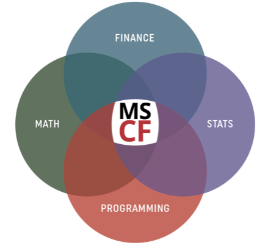

# 2023_Summer_Quant_Internship
2023 Summer Quant Internships, collected by the [MSCF](https://www.cmu.edu/mscf/) program at CMU.

  

Note: Positions with late deadlines usually hire on a rolling basis.

| Company      | Company Type | Job Type (Contains Link to the Posting) | Location | Deadline | Sponsor H1B? (Default Yes)  
|:-----------:|:----------:|:-------------:|:---:|:--------------:|:---------:|
| Aspen Capital  | Private Equity | [Quantitative Financial Analyst](https://app.joinhandshake.com/stu/jobs/7344292?ref=home-unit-item) | NYC | March 31, 2023   |  |
| Balyasny Asset Management  | Hedge Fund/Asset Management | [Quantitative Developer](https://app.joinhandshake.com/stu/jobs/7215407?ref=preview-header-click&search_id=acde6cad-1a2b-46f3-b936-40fa091f4809) | NYC | August 25, 2023   |  |
| VanEck  | Asset Management | [Quantitative Researcher](https://app.joinhandshake.com/stu/jobs/7191821?ref=preview-header-click&search_id=acde6cad-1a2b-46f3-b936-40fa091f4809) | NYC | March 31, 2023   |  |
|   |  | [Quantitative QIS Summer Intern](https://app.joinhandshake.com/stu/jobs/7191805?ref=preview-header-click&search_id=acde6cad-1a2b-46f3-b936-40fa091f4809) | NYC | March 31, 2023   |  |
| Cubist Systematic Strategies  | Hedge Fund | [Quantitative Developer](https://app.joinhandshake.com/stu/jobs/6719571?ref=preview-header-click&search_id=acde6cad-1a2b-46f3-b936-40fa091f4809) | NYC | March 31, 2023   |  |
| Beacon Platform | FinTech | [Quantitative Developer](https://app.joinhandshake.com/stu/jobs/7258882?ref=preview-header-click&search_id=acde6cad-1a2b-46f3-b936-40fa091f4809) | NYC | April 14, 2023   |  |
| Deutsche Bank | Investment Bank | [Quantitative Internship](https://app.joinhandshake.com/stu/jobs/7299430?ref=preview-header-click&search_id=acde6cad-1a2b-46f3-b936-40fa091f4809) | NYC | January 31, 2023   |  |
| D.E. Shaw | Hedge Fund | [Quantitative Analyst](https://app.joinhandshake.com/stu/jobs/7200470?ref=preview-header-click&search_id=acde6cad-1a2b-46f3-b936-40fa091f4809) | NYC | May 31, 2023   |  |
| Schonfeld Strategic Advisors | Hedge Fund | [Quantitative Researcher](https://app.joinhandshake.com/stu/jobs/6945096?ref=preview-header-click&search_id=acde6cad-1a2b-46f3-b936-40fa091f4809) | NYC | January 31, 2023   |  |
| Vatic Investments | Hedge Fund/Prop Trading | [Quantitative Researcher](https://app.joinhandshake.com/stu/jobs/6666402?ref=preview-header-click&search_id=acde6cad-1a2b-46f3-b936-40fa091f4809) | NYC | March 31, 2023   |  |
| TransMarket Group | Prop Trading | [Quantitative Trader](https://app.joinhandshake.com/stu/jobs/7093580?ref=preview-header-click&search_id=acde6cad-1a2b-46f3-b936-40fa091f4809) | Chicago | June 1, 2023   |  |
| Two Sigma | Hedge Fund | [Quantitative Researcher](https://app.joinhandshake.com/stu/jobs/6944180?ref=preview-header-click&search_id=acde6cad-1a2b-46f3-b936-40fa091f4809) | NYC | March 30, 2023   |  |
| Tower Research Capital | Prop Trading | [Quantitative Trader](https://app.joinhandshake.com/stu/jobs/6645872?ref=preview-header-click&search_id=acde6cad-1a2b-46f3-b936-40fa091f4809) | NYC | February 1, 2023   |  |
|  |  | [Quantitative Trader](https://app.joinhandshake.com/stu/jobs/6645845?ref=preview-header-click&search_id=acde6cad-1a2b-46f3-b936-40fa091f4809) | NYC | February 1, 2023   |  |
|  |  | [Quantitative Developer](https://app.joinhandshake.com/stu/jobs/6652221?ref=preview-header-click&search_id=e3ff252c-3be9-40c9-8c99-82e31c15d6ff) | NYC | February 1, 2023   |  |
| Mizuho | Investment Bank | [Quantitative Strategies](https://app.joinhandshake.com/stu/jobs/7371447?ref=preview-header-click&search_id=acde6cad-1a2b-46f3-b936-40fa091f4809) | NYC | January 12, 2023  |  |
| Optiver | Prop Trading | [Quantitative Trader](https://app.joinhandshake.com/stu/jobs/6695486?ref=preview-header-click&search_id=acde6cad-1a2b-46f3-b936-40fa091f4809) | Chicago | January 31, 2023  |  |
| PIMCO | Asset Management | [Quantitative Research](https://app.joinhandshake.com/stu/jobs/7120098?ref=preview-header-click&search_id=acde6cad-1a2b-46f3-b936-40fa091f4809) | California | April 1, 2023  |  |
| Depository Trust & Clearing Corporation | Clearing & Settlement | [Quantitative Risk Management Intern [2023 Summer Intern Program]](https://app.joinhandshake.com/stu/jobs/6947850?ref=preview-header-click&search_id=acde6cad-1a2b-46f3-b936-40fa091f4809) | New Jersey | February 24, 2023   |  |
| Citi | Investment Bank | [Quantitative Risk Management](https://app.joinhandshake.com/stu/jobs/6875340?ref=preview-header-click&search_id=08dab330-5a99-4dc6-a97b-e8f5c6a502bc) | NYC | May 1, 2023   |  |
| Invesco | Asset Management | [Quant Research](https://app.joinhandshake.com/stu/jobs/6876264?ref=preview-header-click&search_id=08dab330-5a99-4dc6-a97b-e8f5c6a502bc) | Boston | February 28, 2023  |  |
| Shanghai Sixie Capital Management Co., Ltd. | Hedge Fund | [Quant Researcher](https://app.joinhandshake.com/stu/jobs/3421563?ref=preview-header-click&search_id=08dab330-5a99-4dc6-a97b-e8f5c6a502bc) | Shanghai, China | December 30, 2024  |  |
|  | | [Quant Developer](https://app.joinhandshake.com/stu/jobs/3421618?ref=preview-header-click&search_id=08dab330-5a99-4dc6-a97b-e8f5c6a502bc) | Shanghai, China | December 30, 2024  |  |
| Jump Trading | Prop Trading | [Quantitative Research](https://app.joinhandshake.com/stu/jobs/6911983?ref=preview-header-click&search_id=59156d0c-c3c9-4407-ae6e-b5c08c4e7945) | Singapore | January 31, 2023  |  |
| Greenwich Commodities LLC | Prop Trading | [Quantitative Analyst](https://app.joinhandshake.com/stu/jobs/7375791?ref=preview-header-click&search_id=59156d0c-c3c9-4407-ae6e-b5c08c4e7945) | Michigan | March 31, 2023  |  |
| SIG | Prop Trading | [Quantitative Research](https://app.joinhandshake.com/stu/postings?page=3&per_page=25&sort_direction=desc&sort_column=default&query=quant) | Pennsylvania | April 1, 2023  |  |
| New York Life Insurance Company | Insurance | [Quantitative Analyst](https://app.joinhandshake.com/stu/jobs/7059581?ref=preview-header-click&search_id=e3ff252c-3be9-40c9-8c99-82e31c15d6ff) | NYC | March 4, 2023  | No |
| Bank of America | Investment Bank | [Quantitative Research](https://app.joinhandshake.com/stu/jobs/6652350?ref=preview-header-click&search_id=e3ff252c-3be9-40c9-8c99-82e31c15d6ff) | NYC | October 15, 2023   |  |
| TD Bank | Investment Bank | [Quantitative Equity](https://app.joinhandshake.com/stu/jobs/7377928?ref=preview-header-click&search_id=e3ff252c-3be9-40c9-8c99-82e31c15d6ff) | NYC | February 28, 2023    |  |
| Northwestern Mutual - Corporate Office | Insurance | [Quantitative Finance](https://app.joinhandshake.com/stu/jobs/6950748?ref=preview-header-click&search_id=e3ff252c-3be9-40c9-8c99-82e31c15d6ff) | Wisconsin |     January 31, 2023 | No |
| Envestnet | FinTech | [QRG Capital Management Intern](https://app.joinhandshake.com/stu/jobs/7265713?ref=preview-header-click&search_id=24a83664-b7c4-4200-b6d8-0b5a0dcb38b9) | Pennsylvania |  January 31, 2023  |  |

